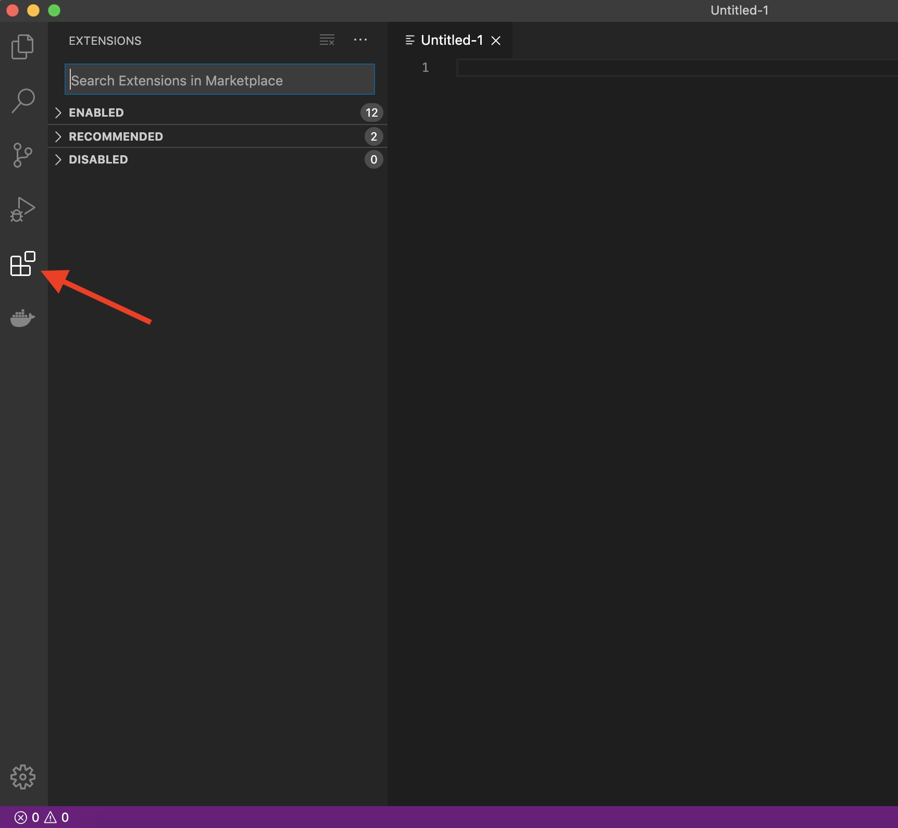

(page_install_ds_stack_ubuntu)=
Ubuntu Install Instructions
=======================

<!-- Open links in a new tab unless they have the `` attribute -->
<head>
    <base target="_blank">
</head>

These instructions will walk you through installing the required software stack for this course. 
Before starting, ensure that your laptop meets the following requirements:

 - runs one of the following operating systems: macOS 11.x, Windows 10, and Ubuntu 20.04.
- can connect to networks via a wireless connection
- has at least 50 GB disk space available
- has at least 8 GB of RAM
- uses English as the default language (if you want TAs or the instructor to help you)
- student user has full administrative access to the computer

**Students' whose laptops do not meet the requirements specified above will not be able to receive technical assistance from the MDS team in troubleshooting installation issues.**

## UBC Student Email

Please sign up for a UBC Student Email. This account will also grant you access to a range of UBC services, including Microsoft Teams and OneDrive. To do so navigate to [https://it.ubc.ca/services/email-voice-internet/ubc-student-email-service](https://it.ubc.ca/services/email-voice-internet/ubc-student-email-service) and follow the instructions under "Get Started". 

## Visual Studio Code

The open-source text editor Visual Studio Code (VS Code) is both a powerful text editor and a full-blown Integrated Development Environment (IDE), which we will use for more complex analysis. 
You can install VS Code either via the [Snap store/Ubuntu software app through this link](https://snapcraft.io/code) or via the downloadable deb-file from the VS code website [https://code.visualstudio.com/download](https://code.visualstudio.com/download). 
The getting started instructions are here: [https://code.visualstudio.com/docs/?dv=linux64_deb](https://code.visualstudio.com/docs/?dv=linux64_deb).

You can test that VS code is installed and can be opened from Terminal by restarting terminal and typing the following command:

```
code --version
```

you should see something like this if you were successful:

```
1.52.1
ea3859d4ba2f3e577a159bc91e3074c5d85c0523
x64
```

## GitHub

In MDS we will use the publicly available [GitHub.com](https://github.com/) as well as an Enterprise version of GitHub hosted here at UBC, [GitHub.ubc.ca](https://github.ubc.ca). Please follow the set-up instructions for both below.

## GitHub.com

We will use the publicly available [GitHub.com](https://github.com/).
You should have already created a GitHub.com account during the lectures, if you have not, you should do so ASAP.

## Configure Git on your computer

We will be using the command line version of Git. 
Some of the Git commands we will use are only available since Git 2.23, so if you're Git is older than this version, we ask you to update it using the following command:

```
sudo apt update
sudo apt install git
```

You can check your git version with the following command:

```
git --version
```

### Configuring Git user info

Next, we need to configure Git by telling it your name and email. To do this type the following into the terminal (replacing Jane Doe and janedoe@example.com, with your name and email (the same you used on GitHub), respectively):

```
git config --global user.name "Jane Doe"
git config --global user.email janedoe@example.com
```

> Note: to ensure that you haven't made a typo in any of the above, you can view your global Git configurations by either opening the configuration file in a text editor (e.g. via the command `code ~/.gitconfig`) or by typing `git config --list --global`.

### Setting VS Code as the default editor

To make programs run from the terminal (such as `git`) use VS Code by default, we will modify the bash configuration file `~/.bashrc`. First, open it using VS Code:

```
code ~/.bashrc
```

Append the following lines:

```
# Set the default editor for programs launch from terminal
EDITOR="code --wait"
VISUAL=$EDITOR  # Use the same value as for "EDITOR" in the line above
```

Then save the file and exit VS Code.

> Most terminal programs will read the `EDITOR` environmental variable when determining which editor to use, but some read `VISUAL`, so we're setting both to the same value.

### VS Code extensions

The real magic of VS Code is in the extensions that let you add languages, debuggers, and tools to your installation to support your specific workflow. 
From within VS Code you can open up the [Extension Marketplace (read more here)](https://code.visualstudio.com/docs/editor/extension-gallery) to browse and install extensions by clicking on the Extensions icon in the Activity Bar indicated in the figure below.



To install an extension, you simply search for it in the search bar, click the extension you want, and then click "Install". 
There are extensions available to make almost any workflow or task you are interested in more efficient! 
To do this, search for and install the following extensions:

- Java Extension Pack (0.12.1) by Microsoft
- Processing Language (1.4.5) by Tobiah Zarlez
- markdownlint (markdown linting and style checking extension)
- GitLens - Git supercharged (powerful extension that extends VS Code's native git capabilities)
- (Optional) Bracket Pair Colorizer 2 (add colour to help distinguish your brackets: (), [], {})

## Post-installation notes

You have completed the installation instructions, well done 🙌!
Remember to add a screenshot as instructed in your lab!

### Attributions

```{important} 
This guide has been (lightly) adapted from the UBC-Vancouver [MDS Install stack](https://ubc-mds.github.io/resources_pages/installation_instructions/) under a CC-BY-SA 4.0 license.
```

* [Harvard CS109](http://cs109.github.io/2015/)
* [UBC STAT 545](http://stat545.com/packages01_system-prep.html#mac-os-system-prep) licensed under the [CC BY-NC 3.0](https://creativecommons.org/licenses/by-nc/3.0/legalcode).
* [Software Carpentry](https://software-carpentry.org/)
