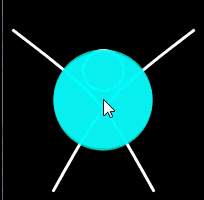
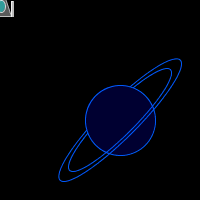

# Lab 4

In this lab, you will be practicing with coordinate transformations and interactive programs.

### Expectations

We are expecting you to commit your work often with useful commit messages.
This is helpful for you so that there are regular commits that demonstrate your progress. 
In case you forget to push your final commits before the deadline, at least you will get partial marks.

This means that you should commit and push your changes to the repository at least **FIVE** times as you work this lab (more is recommended).
Repositories that have very few commits will be flagged for careful scrutiny and review, and you will **definitely** lose marks for this! 

## Q1. Dancing in the night

Create a scene with a simple “dancer” character and four moving lights similar to this:

Note: the image above is an animated gif - if you cannot see the image moving, try looking at the [mp4 file](./dancer.mp4) or the [animated gif](./dancer.gif).

- The dancer’s movements and the lights’ color and position are all controlled by the mouse location.
- The head moves just a bit towards the mouse.

 ***Hints:*** 
- It would be easier if you use the HSB model to control the lights’ color.

- The big X (representing the dancer’s body) is actually two Bezier curves of which the “control points” are moving with the mouse.

### Marking Requirements:

This question is worth **20 marks** distributed as follows:
- **+4** for the overall sketch (dancer and four lights).
- **+4** for animating the Bezier curves with the mouse.
- **+4** for the head movement (remember: the head’s location doesn’t match the mouse location).
- **+4** for animating the lights color
- **+4** for animating the lights position
- **Up to +2 bonus marks** for distinguished work (e.g. better dancer design, more creative scenes).

Reminder: You do NOT have to (but you can if you like) duplicate the animated gif exactly, this class is called computer creativity, so be creative!

> For this question, you do not need to include a screenshot, the TAs will download and run your code.

## Q2.

Create a controlled animation that includes a spaceship and a planet. The location of the spaceship is controlled by the mouse as in this animation: 

Note: the image above is an animated gif - if you cannot see the image moving, try looking at the [mp4 file](./spaceship_planet.mp4) or the [animated gif](./spaceship_planet.gif).

- The spaceship is semi-transparent with two guns on the sides and an ellipse in the middle.
- Use coordinate transformation to move the spaceship.
- Use another coordinate transformation to draw the
planet.

 ***Hints:*** 
- To use two different coordinate transformations, you will need to save the coordinates before you draw an item, e.g. the planet, and then restore them right after you finish drawing that planet. Use pushMatrix() and popMatrix().
- To draw the planetary rings, use a function called arc() that has the syntax: 
      arc(x, y, w, h, start_angle, end_angle)
      x,y,w,h are the same as an ellipse
      start_angle and end_angle determine the beginning and end of the arc and are specified in radians.
- To hide the mouse curser, use noCursor() function.

### Marking Requirements:

This question is worth **20 marks** distributed as follows:
- **+4** for the look of the spaceship.
- **+4** for the look of the planet. (2 marks are deducted if the planetary rings are not inclined as in the screenshot)
- **+6** for proper use of coordinate transformation for both the spaceship and the planet.
- **+6** for moving the spaceship with the mouse.
- **Up to +2 bonus marks** for distinguished work (e.g. better spaceship, more creative scene).

> For this question, you do not need to include a screenshot, the TAs will download and run your code.

## Submission Instructions 

For this Lab, you need to do the following: 

1. Create a file called `lab4_q1.pde` and `lab4_q2.pde` in this repo. You may put these in separate folders if you like (just update the links to the files below).
1. Complete Q1 and Q2 as described above.
1. Submit your repo URL to Canvas before the deadline (we will mark the last commit before the deadline)

## Grading area

### Link to files

You do not have to do anything in this section.

[Q1 file](./lab4_q1.pde)

[Q2 file](./lab4_q2.pde)
