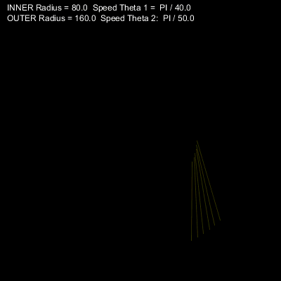
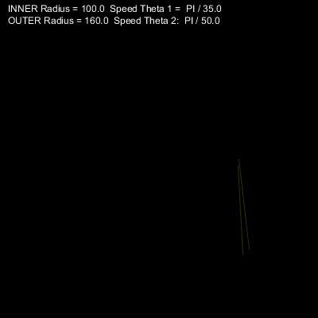
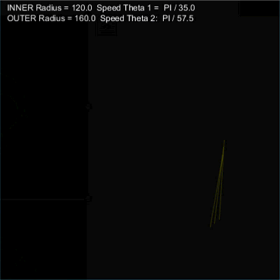
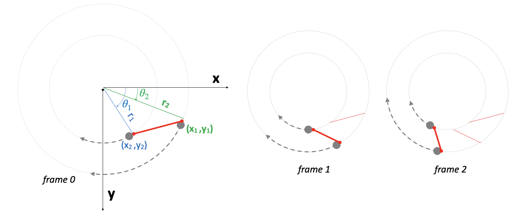
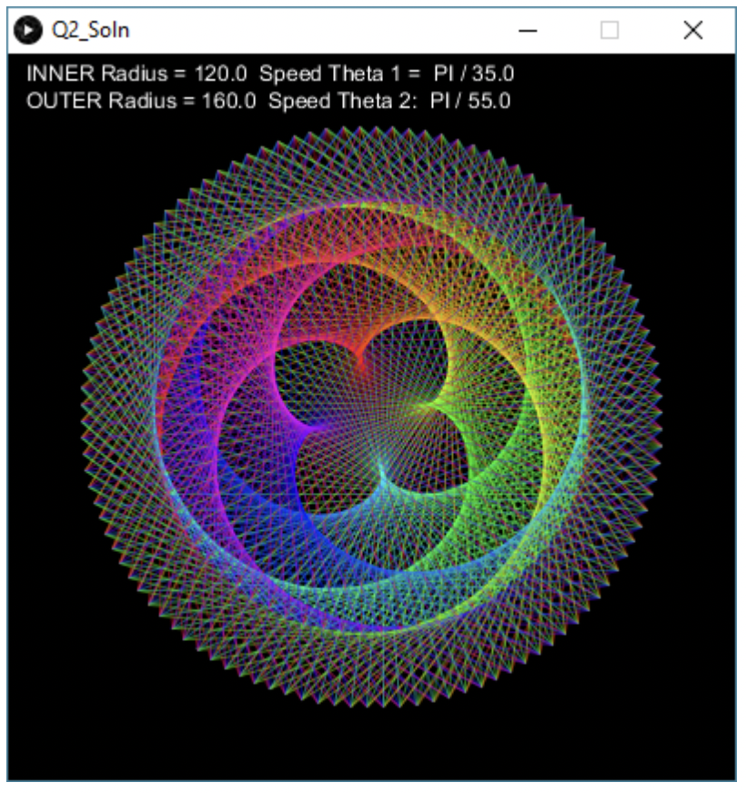

# Lab 6

In this lab, you will be practicing with using variables to control animation.

### Expectations

We are expecting you to commit your work often with useful commit messages.
This is helpful for you so that there are regular commits that demonstrate your progress. 
In case you forget to push your final commits before the deadline, at least you will get partial marks.

This means that you should commit and push your changes to the repository at least **FIVE** times as you work this lab (more is recommended).
Repositories that have very few commits will be flagged for careful scrutiny and review, and you will **definitely** lose marks for this!

For each question in this assignment, you need to do the following:
1.	Download the starter code.
2.	Run the starter code and observe the output. 
3.	Fill in the missing code as per the instructions given in the starter code. These instructions are written as comments that start with “REQ”.

## Q1. Animation

Create a program that animates the creation of shapes similar to the ones below:

Use the [starter code](./q1/q1.pde) and then complete the missing code in order to create the above animations.
The basic idea is as follows (see the diagrams below):

- Draw a line in each new frame without clearing the previous frames.
- The start and end points of the line should constantly move along the circumference of two circles located at the sketch center. 
- Use circle equations: x = r cos(theta) and y = r sin(theta) to determine the position of the points
- Animate the angle theta for the two points at different speeds. 

### Marking Requirements:

This question is worth **15 marks** distributed as follows:
- **+2** for moving the origin to the center of the sketch
- **+2** for computing (x1,y1) and (x2,y2) using r and theta (circle equations)
- **+1** draw a line between (x1,y1) and (x2,y2)
- **+8** animate theta1 and theta2

## Q2. Animation and Color

Add more code to your design in order to also animate the color of the line. A sample output is shown below.

*Hint: use HSB color mode*

### Marking Requirements:

This question is worth **5 marks** distributed as follows:
- **+4**	for assigning rainbow colors to the lines  as in the screenshot.
- **+1** for not overusing one color over the others. That is, when your reach the end of the color spectrum, you should start all over again, i.e. color1 -> color2 -> … -> color255 -> color 1 -> color 2 -> etc

## Q3. Animating Scale, Angle, and Transparency

Write code that results in this animation

*Follow these steps*
- Create a still design first. Note that you will need to transform the coordinates to properly produce the required design.
- Identify the attributes that need to be animated. In this example, you will need to animate (1) the coordinates scale and angle, and (2) the transparency of all items.
- Create a variable for each attribute you want to animate. In this example, you will have exactly three variables for scale, angle, and transparency.
- Replace that attributes’ values with the variables.
- Slightly modify that variables at the end of each frame.

### Marking Requirements:

This question is worth **10 marks** distributed as follows:
- **+2**	for correct design.
- **+2** for correct transformation
- **+6** for animating 3 attributes: scale, angle, and transparency (+2 each)

## Submission Instructions 

For this lab, you need to do the following: 

1. Complete Q1, Q2, and Q3 as described above.
2. Submit your repo URL to Canvas before the deadline (we will mark the last commit before the deadline + grace period)

## Grading area

### Link to files

You do not have to do anything in this section.

[Q1 file](./q1/q1.pde)

[Q2 file](./q2/q2.pde)

[Q3 file](./q3/q3.pde)