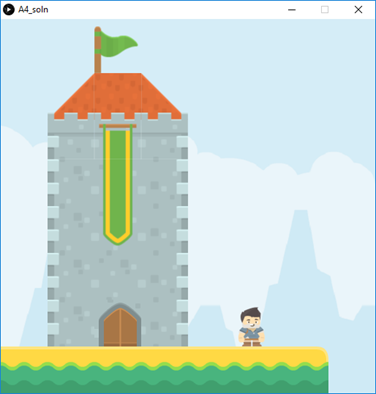

# Lab 7

In this lab, you will be practicing with images to build a game platform.

### Expectations

We are expecting you to commit your work often with useful commit messages.
This is helpful for you so that there are regular commits that demonstrate your progress. 
In case you forget to push your final commits before the deadline, at least you will get partial marks.

This means that you should commit and push your changes to the repository at least **FIVE** times as you work this lab (more is recommended).
Repositories that have very few commits will be flagged for careful scrutiny and review, and you will **definitely** lose marks for this! 

## Q1. Create a Scene

In this lab, you are required to build a complex and creative platform.
- Go to [http://kenney.nl/assets](http://kenney.nl/assets). Familiarize yourself with the assets (tiles) available there. Make sure to read the copyright note before you download and use any of these assets (as of Feb 2018, assets on Kenney are free to download and use).
- To build _my_ platform below, I mainly used the following two packages from Kenney: 
    - Platformer Abstract ([download](https://people.ok.ubc.ca/abdalmoh/teaching/123/Labs/A4/resources/platformer_abstract.zip))
    - Platformer Pack Medieval ([download](https://people.ok.ubc.ca/abdalmoh/teaching/123/Labs/A4/resources/platformer_medieval.zip))
    - You will probably need to use these two packages. However, you also need to use additional packages in order to be creative with your design. 
- Put the tiles of your choice (based on your design) on the game sketch.
- As with the class exercise, your player character should still move horizontally with the mouse. 

Here is my design, but **your design should be different** (you can use the same tiles I used, but create a different platform. You can also use other tiles from other packages). 
Note: the “Platformer Pack Medieval” has a sample image with good ideas for different designs.

### Marking Requirements:

This lab is worth **15 marks** distributed as follows: 
- **+4** for having at least one _big_ building (e.g. the tower in my design)
- **+2** for having at least one flag (the one on top of the tower in my design)
- **+2** for having at least one banner flag (the long green and yellow one above the door in my design)
- **+2** for having at least one door or window
- **+2** for the ground
- **+2** for a player character that moves horizontally with the mouse.
- **+1** for having a background image (not a plain text)
- **Up to +5 bonus marks** for creativity and complexity 

## Submission Instructions 

For this Lab, you need to do the following: 

1. Complete Q1 as described above
2. Submit your repo URL to Canvas before the deadline (we will mark the last commit before the deadline)

## Grading area

### Link to files

You do not have to do anything in this section.

[Q1 file](./q1/q1.pde)