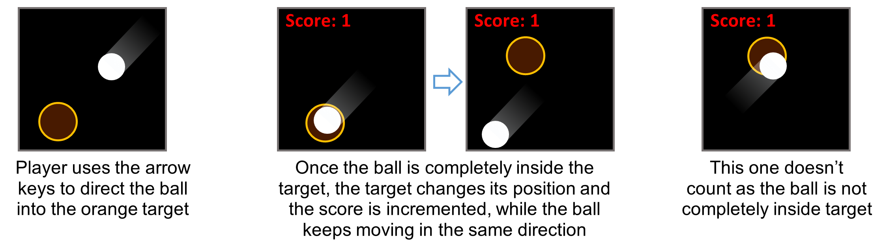
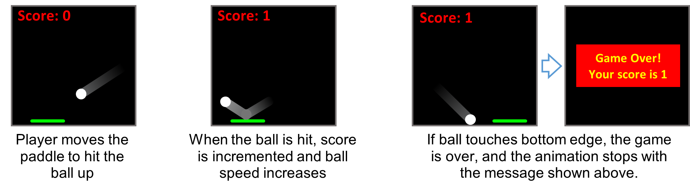
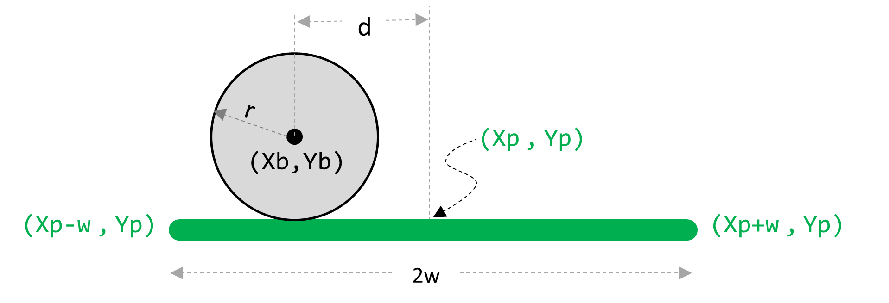
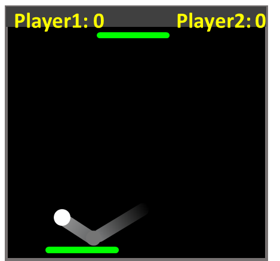

# Lab 8

In this lab, you will be practicing with conditionals and interactive programs.

## Expectations

We are expecting you to commit your work often with useful commit messages.
This is helpful for you so that there are regular commits that demonstrate your progress. 
In case you forget to push your final commits before the deadline, at least you will get partial marks.

This means that you should commit and push your changes to the repository at least **FIVE** times as you work this lab (more is recommended).
Repositories that have very few commits will be flagged for careful scrutiny and review, and you will **definitely** lose marks for this!

For each question in this assignment, you need to do the following:
1.	Download the starter code.
2.	Run the starter code and observe the output. 
3.	Fill in the missing code as per the instructions given in the starter code. These instructions are written as comments that start with “REQ”.

## Q1. Aim-for-Target Game

In class, we created a simple animation of a ball bouncing off the edges of a sketch. In this question, we will turn this animation into a simple game where the player tries to score by directing the bouncing ball into a target circle. The player should use the arrow keys to slightly modify the direction of the ball. Whenever the ball is completely inside the target, the score is incremented and the target moves to a new random location. To make the game challenging, the target is designed to be just a little bigger than the ball. 

### Marking Requirements:

This question is worth **10 marks** distributed as follows:
- **+1**	for bouncing the ball off the edges
- **+4**	for checking if the ball is inside the target and taking actions if it does.
- **+5**	for reacting to key presses.
- **Up to +2 bonus marks** are given for replacing the ball with an image and making any necessary changes (e.g. changing the target to a square if the shape in the image is a square).
 
 
## Q2. Pong Game

In this question, we will reuse the bouncing ball idea again but in a different game. Here, the player does not control the ball. The game starts with the ball moving in a certain direction, bouncing off the left, right, and top edges. The ball, however, doesn’t bounce off the bottom edge. Instead, the player uses the mouse to horizontally move a paddle located at the bottom of the sketch, trying to hit the ball when it is at the bottom edge. The score is incremented whenever the player successfully hits the ball with the paddle. If the player misses the ball, the game ends with a message that shows the score. To make the game a bit challenging, the ball speed increases a little bit (e.g. by 10%) every time the player hits the ball.

How to check if the ball lands on the paddle? When the ball is at the lower edge, measure the distance d as illustrated below. The ball lands on the paddle if d is less than (w+r)

### Marking Requirements:

This question is worth **10 marks** distributed as follows:
- **+2**	for bouncing the ball off 3 edges
- **+3**	for checking if ball lands on paddle.
- **+5**	for (incrementing score, bouncing the ball up, and increasing speed) and (ending the game)
- **Up to +5 bonus marks** for changing this to a 2-player game. You will need to add another paddle at the top of the sketch (or you may choose to have the two paddles at the right/left sides of the sketch). The other paddle should be controlled another player who uses the left and right arrow keys. The ball will always bounce off the edges with no paddles. But it will only bounce off the paddle at those edges with the paddle. If the ball doesn’t land on a paddle of one player, the score of the other player is incremented and the ball resets its location. You will need to make further changes such having two score variables, etc.

## Submission Instructions 

For this lab, you need to do the following: 

1. Complete Q1 and Q2 as described above.
2. Submit your repo URL to Canvas before the deadline (we will mark the last commit before the deadline)

## Grading area

### Link to files

You do not have to do anything in this section.

[Q1 file](./q1/q1.pde)

[Q2 file](./q2/q2.pde)

