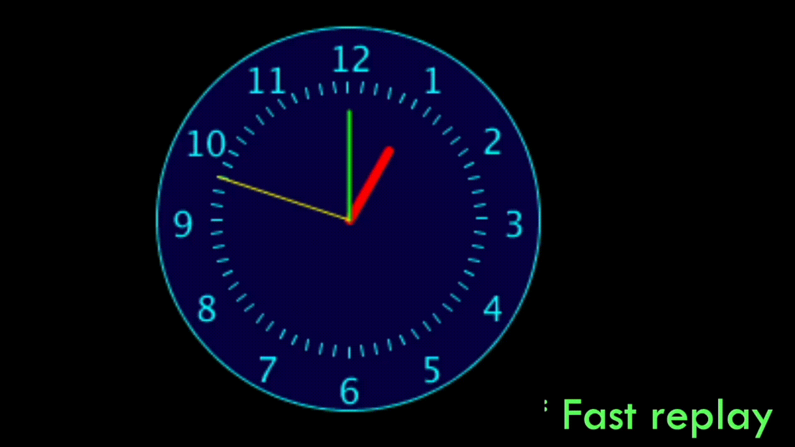

# Task 1 - Analogue Clock Version 3

In this task we will be improving our analogue clock code from the previous lecture activity to look similar to the given figure.
You will be provided some starter code, and you'll be expected to use loops.

[Starting with the code provided](task1.pde), use loops to
  * Put all the numbers from 1 to 12
  * Put all the little minute ticks (dashes) around the clock. 

There are additional hints and suggestions in the code provided you should use to finish your animation.

## Embed an animated gif of your drawing

Embed the animated gif you created here using markdown syntax: ``
