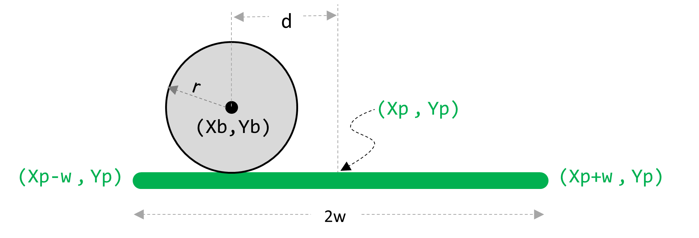
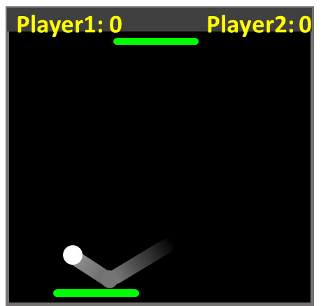

# Task 2: Pong Game

In this question, we will reuse the bouncing ball idea again but in a different game. 
Here, the player does not control the ball.
The game starts with the ball moving in a certain direction, bouncing off the left, right, and top edges but NOT the bottom edge.

How do you check if the ball lands on the paddle? 
When the ball is at the lower edge, measure the distance d as illustrated below.
The ball lands on the paddle if d is less than (w+r)

## Specifications

- We are expecting you to commit your work often (try to aim for a minimum of 3-5 commits per lab) with useful commit messages marking your progress.
- There is some starter code provided to you in [task2.pde](task2.pde). You should update this code.
- The ball should bounce off the left, right, and top edges.
- The player should use the mouse to horizontally move a paddle located at the bottom of the sketch, trying to hit the ball when it is at the bottom edge.
- The score is incremented whenever the player successfully hits the ball with the paddle.
- If the player misses the ball, the game ends with a message that shows the score. 
- To make the game a bit challenging, the ball speed should increases a little bit (e.g. by 10%) every time the player hits the ball.
- Check if ball lands on paddle and completing the following tasks when it does: 
  - incrementing score
  - bouncing the ball up from the paddle and increasing speed
  - ending the game

**Optional** To challenge yourself, change this to a 2-player game. You will need to add another paddle at the top of the sketch (or you may choose to have the two paddles at the right/left sides of the sketch). The other paddle should be controlled another player who uses the left and right arrow keys. The ball will always bounce off the edges with no paddles. But it will only bounce off the paddle at those edges with the paddle. If the ball doesn’t land on a paddle of one player, the score of the other player is incremented and the ball resets its location. You will need to make further changes such having two score variables, etc.

## Embed an animated gif of your drawing

Embed the animated gif you created here using markdown syntax: ``
