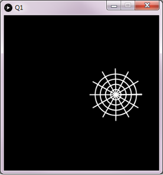
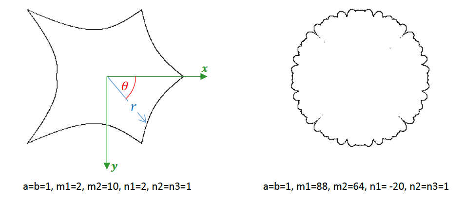

# Lab 9
In this lab, you will be practicing with loops and functions.

### Expectations

We are expecting you to commit your work often with useful commit messages.
This is helpful for you so that there are regular commits that demonstrate your progress. 
In case you forget to push your final commits before the deadline, at least you will get partial marks.

This means that you should commit and push your changes to the repository at least **FIVE** times as you work this lab (more is recommended).
Repositories that have very few commits will be flagged for careful scrutiny and review, and you will **definitely** lose marks for this! 

For each question in this assignment, you need to do the following:
1. Download the starter code.
2. Run the starter code and observe the output.
3. Fill in the missing code as per the instructions given in the starter code. These instructions are written as comments that start with “REQ”.

## Q1.Bouncing Spider Web

In class, we created a simple animation of a bouncing ball. In this question, we will replace the ball with a spider-web-like shape similar to the one in the figure. You must use loops to draw the lines and circles.

### Marking Requirements:

This question is worth **8 marks** distributed as follows:
- **+4** for drawing many circles.
- **+4** for drawing many lines.
- **Up to +3 bonus marks** for drawing a colourful spider-web (different colors for circles and lines).

## Q2. Superformula

A supershape is a complex shape that can be found in nature. It can be described using the superformula below:

Where 𝑟 is the distance between a point on the shape and its center. Different values of a, b, m1, m2, n1, n2, and n3 result in different shapes: see the two examples below. More examples can be found [here](https://en.wikipedia.org/wiki/Superformula).

A supershape may be created in Processing as follows: write a loop where 𝜃 is the loop counter that changes from 0 to a 2π with a very small increment. For each new value of 𝜃, compute 𝑟 using the superformula above. Then, use 𝑟 to compute the position of a point on the shape using the circle’s polar equations:
𝑥=𝑠𝑐𝑎𝑙𝑒∗ 𝑟∗ cos𝜃 and 𝑦=𝑠𝑐𝑎𝑙𝑒∗ 𝑟∗ sin𝜃, 
where scale is the size of the shape (e.g. above shapes were produced using 𝑠𝑐𝑎𝑙𝑒=100)
In this question, you are required to complete the missing code in the given starter code to produce two concentric supershapes similar to the output below.

 ***Hint:*** You will need to use the built in Processing functions abs(), sin(), and pow() for your computations.

### Marking Guide:

This question is worth **12 marks** distributed as follows:
- **+4** for appropriate loop structure and values
- **+4** for correct computation of r
- **+1** for correct computation of x,y
- **+4** for using x,y, and r to draw the shape
- **+2** for drawing the red supershape (REQ2)

- **Up to +2 bonus marks** for gradually changing the color of each point on the shape as follows:

## Submission Instructions 

For this lab, you need to do the following: 

1. Complete Q1 and Q2 as described above.
2. Submit your repo URL to Canvas before the deadline (we will mark the last commit before the deadline)

## Grading area

### Link to files

You do not have to do anything in this section.

[Q1 file](./q1/q1.pde)

[Q2 file](./q2/q2.pde)
