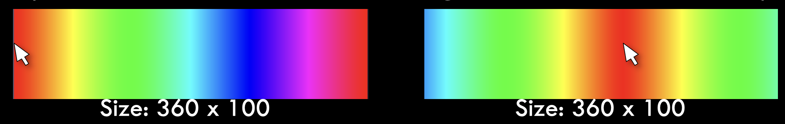

# Task 2 - Loops and User Interactivity

A) Write code to show all colors as in the example below – note that the red color follows the mouse. Hint: use HSB mode!

B) Change your above code so that the output is similar to below

## Embed an animated gif of your drawing

Embed the animated gif you created here using markdown syntax: ``

