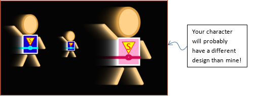

# Lab 11

In this lab, you will be practicing Object Oriented Programing (OOP).

## Expectations

We are expecting you to commit your work often with useful commit messages.
This is helpful for you so that there are regular commits that demonstrate your progress. 
In case you forget to push your final commits before the deadline, at least you will get partial marks.

This means that you should commit and push your changes to the repository at least **FIVE** times as you work this lab (more is recommended).
Repositories that have very few commits will be flagged for careful scrutiny and review, and you will **definitely** lose marks for this!

For each question in this assignment, you need to do the following:
1.	Download the starter code.
2.	Run the starter code and observe the output. 
3.	Fill in the missing code as per the instructions given in the starter code. These instructions are written as comments that start with “REQ”.

## Q1. Hero Class

In this question, you will create a class named `Hero` for your custom character (the one that we created in the beginning of this semester). Here are the specs for the class:

- **Attributes**: `x`, `y`, `scale`, `speedX`, `speedY`, `torsoColor`, and `beltColor`.
- **Constructors**:
    - zero-argument constructor that sets attributes as: `x=width/2`, `y=height/2`, `scale=1`, `speedX=1`, `speedY=0`, `torsoColor=color(19,0,205)`, and `beltColor=color(0,255,255)` (your colors can be different of course).
    - 3-argument constructor to set `x`, `y` and `scale` to given values. Other attributes should use the same values used in the zero argument constructor. Use this header: ```Hero(float x1, float y1, float scale1)```
    - 7-arg constructor to set all attributes to given values. Use this header: ```Hero(float x1, float y1, float scale1, float sx, float sy, color torsoClr, color beltClr)```
- **Functions**:
    - `move()` to move the character and _wrap_ it around the screen when going outside sketch boundaries (e.g. when it passes the right edge, it should reappear at the left edge).
    - `display()` to draw the character as per the design that you made before.




### Marking Requirements:

This question is worth **10 marks** distributed as follows:
- **+2** for Hero class header and attributes.
- **+3** for three constructors.
- **+3** for move function (with wrapping).
- **+2** for display function.

## Q2. Animation and Color

In this question, you will rewrite you solution from the previous lab (Lab 10) but using OOP. You will need to create a class `Button` for your buttons (create other classes if you wish, but the marking will be based on the `Button` class only). A `Button` class should have:
- **Attributes** for the width, height, position (x,y), caption (text), and fill color.
- **Two constructors**:
    - A zero-argument constructor to set the above attributes to default values.
    - A six-argument constructor to set the above attributes to given values.
- **Functions**:
    - `boolean mouseOver()` that returns `true` if the mouse is over the button, and `false` otherwise.-
    - `void display()` to draw a button object. This should be the same as the `drawButton()` function from the starter-code of lab10 except that `display()` should have no arguments. Instead, it should use the above attributes to determine how the button will be displayed. Note that the button’s outline should always be white.

### Marking Requirements:

This question is worth **15 marks** distributed as follows:
- **+2** for creating two buttons
- **+1** for drawing either scene0 or scene1 (under the draw() function).
- **+8** for Button class (**+1** for attributes, **+2** for constructors, **+3** for mouseOver, **+2** for display)
- **+2** for the scene0 (**+1** for copied code, **+1** for calling button b0’s display function).
- **+2** for the scene1 (**+1** for copied code, **+1** for calling button b1’s display function).

## Submission Instructions 

For this lab, you need to do the following: 

1. Complete Q1 and Q2 as described above.
2. Submit your repo URL to Canvas before the deadline (we will mark the last commit before the deadline + grace period)

## Grading area

### Link to files

You do not have to do anything in this section.

[Q1 file](./q1/q1.pde)

[Q2 file](./q2/q2.pde)