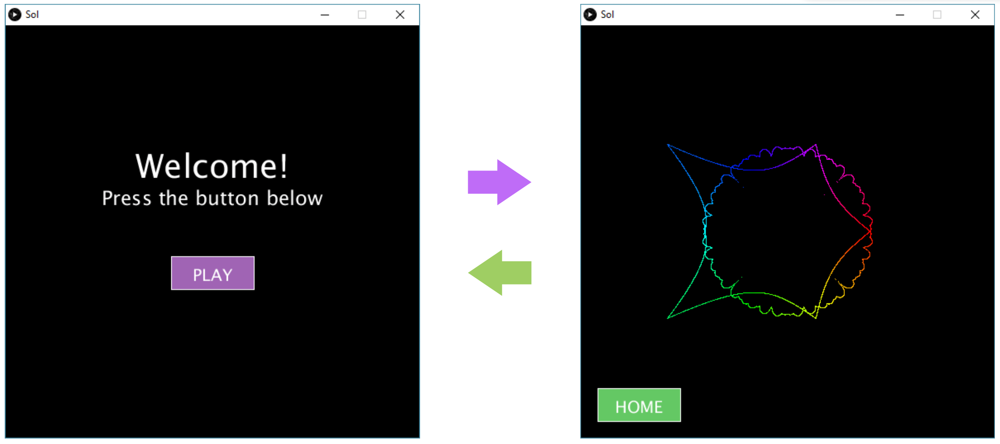

# Lab 10

In this lab, you will be practicing with functions and multi-scene animation.

## Expectations

We are expecting you to commit your work often with useful commit messages.
This is helpful for you so that there are regular commits that demonstrate your progress. 
In case you forget to push your final commits before the deadline, at least you will get partial marks.

This means that you should commit and push your changes to the repository at least **FIVE** times as you work this lab (more is recommended).
Repositories that have very few commits will be flagged for careful scrutiny and review, and you will **definitely** lose marks for this!

For each question in this assignment, you need to do the following:
1.	Download the starter code.
2.	Run the starter code and observe the output. 
3.	Fill in the missing code as per the instructions given in the starter code. These instructions are written as comments that start with “REQ”.

## Q1. Scene Switching

In class, we created a simple multi-scene animation where the user can go from one scene to the other by pressing certain keys on the keyboard. In this assignment, you will repeat this exercise again but with the following differences:

- Switching scenes is done by clicking a button on the sketch in each scene. That is, clicking the PLAY button on the home screen takes you to the second scene, and clicking the HOME button in the second scene takes you back to the home screen (see the figure below). Hint: we have seen how to do this in the “Conditionals” lecture.

- The second scene (on the right figure below) should include any other complex animation you've done in the past, for example the spider web from Lab 9, or the super shape. It can also include any other complex animation if you wish (make sure it works, and you clearly indicate in the comments which animation you used).

### Marking Requirements:

This question is worth **15 marks** distributed as follows:
- **+3** for choosing to draw either the first or the second scene in the draw() method.
- **+4** for the home screen (on the left above).
- **+4** for the second scene (on the right above).
- **+4** for handling mouse clicks on the PLAY and HOME buttons.
- **Up to +3 bonus marks** for adding one more scene and two buttons per scene that allow switching from one scene to any of the other two; e.g. for scene1 on the right in the above figure, you should one extra button that takes you to a third scene.

## Submission Instructions 

For this lab, you need to do the following: 

1. Complete Q1 as described above.
2. Submit your repo URL to Canvas before the deadline (we will mark the last commit before the deadline + grace period)

## Grading area

### Link to files

You do not have to do anything in this section.

[Q1 file](./q1/q1.pde)
